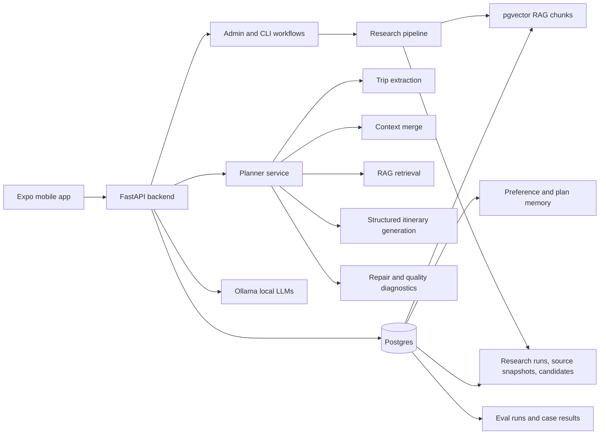
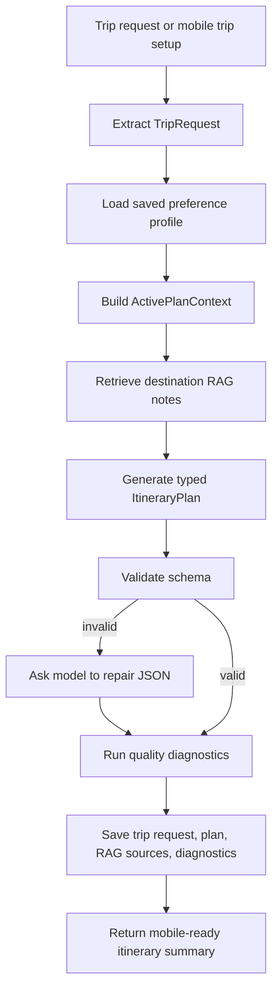
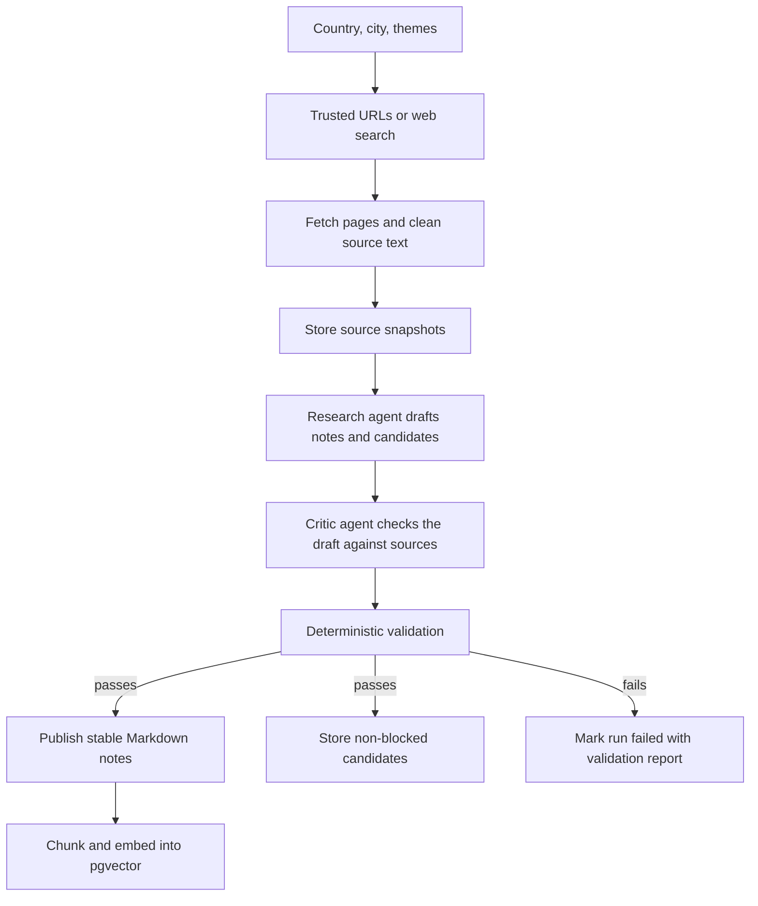

# Northstar

Northstar is a local-first AI travel planner. The mobile app makes the product usable end to end, but the main work is in the backend: structured LLM calls, RAG, evals, research jobs, Postgres persistence, and checks for when the model returns something messy.

I built it around a practical problem: open-source LLMs can write a travel plan, but without destination context they drift into generic advice. Northstar gives the model better inputs, asks for typed output, reviews that output, and stores enough metadata to compare and debug model behavior later.

## What it does

- Learns durable travel preferences through a short onboarding chat.
- Turns free-form trip requests into a validated `TripRequest` schema.
- Merges saved preferences with trip-specific overrides into an `ActivePlanContext`.
- Retrieves destination notes from pgvector before planning.
- Generates structured day-by-day itineraries with meals, cafes, transport, accommodations, preference matches, and source notes.
- Repairs invalid structured output when possible.
- Records softer quality warnings instead of failing every slightly imperfect itinerary.
- Runs offline research jobs that gather, review, and publish destination knowledge.
- Stores eval runs so different LLM models can be compared on the same use cases.

## System architecture



## Planning flow

The planner does not send the user's prompt straight to the model and hope for the best. It breaks the problem into smaller contracts.



The strict part is schema validation. If the model omits a required field or returns malformed structured data, the backend tries a repair pass and then fails cleanly if the repair still does not validate.

The review layer is deliberately looser. A travel plan can be useful even if a meal item is missing one optional metadata field, but that should still be visible. Northstar records warnings such as missing transport metadata, missing meal metadata, or possible unverified venue names. Those diagnostics are saved with the plan and can be summarized later.

Relevant code:

- `apps/api/src/northstar/agent/extract.py`
- `apps/api/src/northstar/agent/context.py`
- `apps/api/src/northstar/rag/retriever.py`
- `apps/api/src/northstar/agent/itinerary.py`
- `apps/api/src/northstar/agent/planner_service.py`
- `apps/api/src/northstar/memory/plan_store.py`

## Research pipeline

Travel data changes, but not all of it changes at the same speed. A city's neighborhoods, transit patterns, and planning caveats are stable enough to research separately. Exact opening hours, closures, and specific venue options need more caution.

Northstar keeps those concerns apart. Stable planning knowledge becomes RAG notes. Specific cafes, restaurants, accommodations, and attractions become database candidates with trust labels and source URLs.



The critic agent matters because fetched web text is untrusted input. It may be stale, weakly sourced, contradicted by another source, or contain prompt-injection style content. The research agent drafts from the sources, then the critic reviews the draft before the system publishes anything into RAG or candidate storage.

This split also lets the system use different model choices for different jobs. Research can afford a slower, heavier model because it runs outside the user request path. The planner can use a lighter model when latency matters, backed by the context the research pipeline already prepared.

Relevant code:

- `apps/api/src/northstar/research/agent.py`
- `apps/api/src/northstar/research/critic.py`
- `apps/api/src/northstar/research/service.py`
- `apps/api/src/northstar/research/fetcher.py`
- `apps/api/src/northstar/research/discovery.py`
- `apps/api/src/northstar/research/publisher.py`
- `apps/api/src/northstar/research/store.py`

## RAG design

RAG is used to make smaller local models more useful, not to dump arbitrary web text into the prompt.

Stable notes live as Markdown under `apps/api/rag_docs`. They are chunked, embedded, and stored in pgvector with country, city, and document-type metadata. At planning time, the backend builds a retrieval query from the active trip context, searches city-scoped chunks first, and falls back to broader search if needed.

Plan storage keeps a compact copy of the RAG context: source metadata and hashes of the retrieved notes. That gives enough traceability to inspect which sources influenced a saved itinerary without duplicating the full retrieved text into every plan row.

Specific options are separate. The research pipeline stores cafes, restaurants, accommodations, and other candidates in `research_candidates` with trust ratings, price levels, timestamps, and source URLs. Those candidates are available through a safe `search_candidates` tool rather than exposing raw database access to the model.

## Evaluation

LLM evaluation is part of the app, not an afterthought. The point is to compare models on the tasks Northstar actually needs:

- Can the model extract the right destination, dates, pace, and preferences from a messy trip request?
- Can it identify durable user preferences during onboarding?
- Can it produce an itinerary with the required structure and enough planning metadata?
- Does it use RAG context and preference matches often enough to justify the extra retrieval step?

Eval cases are JSONL files in `apps/api/evals/cases`. The scorer mixes exact checks with softer checks:

- exact checks for schema-critical fields like `destination_city` or `duration_days`
- contains checks for lists where wording may vary
- minimum-count checks for fields such as `source_notes` and `preference_match`
- structural checks for timeline item types and transport metadata

That balance matters. If the scorer is too strict, a good model fails because it used a different valid word. If the scorer is too loose, a bad itinerary slips through.

Eval runs can be saved to Postgres, listed later, and compared by model name. Saved plans also feed two lightweight operational reports: itinerary quality warnings and RAG coverage.

Relevant code:

- `apps/api/src/northstar/evals/runner.py`
- `apps/api/src/northstar/evals/scorers.py`
- `apps/api/src/northstar/memory/eval_store.py`
- `apps/api/evals/cases`
- `apps/api/tests/test_eval_runner.py`
- `apps/api/tests/test_eval_scorers.py`

## Backend surface

The backend is a FastAPI app plus a Typer CLI.

Main API routes:

- `POST /onboarding/messages` learns and saves travel preferences.
- `GET /profile` returns the saved preference profile.
- `GET /destinations` and `GET /destinations/{id}` serve the curated destination catalog.
- `POST /itinerary-plan-runs` starts an async itinerary run for the mobile app.
- `GET /itinerary-plan-runs/{run_id}` lets the mobile app poll planning status.
- `GET /itinerary-plans/{plan_id}/summary` returns a mobile-ready plan view.
- `POST /admin/research/runs` starts a research run.
- `GET /admin/evals/quality` and `GET /admin/evals/rag-coverage` summarize saved plan diagnostics.

Useful CLI commands:

```bash
cd apps/api
uv run northstar eval trip_extraction
uv run northstar eval itinerary_structure
uv run northstar research-city Kyoto --country Japan --theme cafes --trusted-url https://kyoto.travel/en/
uv run northstar rag-search "quiet cafes in Kyoto"
uv run northstar eval-quality
uv run northstar eval-rag-coverage
```

## Mobile app

The mobile app is intentionally thinner than the backend. It demonstrates the full product loop:

- onboarding chat with Nori
- destination discovery
- trip setup with dates, pace, budget, interests, and food preferences
- async planning status
- saved itinerary summaries
- profile memory view

It is built with Expo Router and React Native. See `apps/mobile/README.md` for mobile-specific setup.

## Tech stack

- Python, FastAPI, Typer
- Ollama for local chat, structured output, tool calls, and embeddings
- PostgreSQL, SQLAlchemy, Alembic
- pgvector for RAG search
- Pydantic for schemas and validation
- Expo, React Native, Expo Router
- pytest and TypeScript type checking

## Repository map

```text
apps/
  api/
    src/northstar/
      agent/        LLM extraction, onboarding, planning, itinerary validation
      api/          FastAPI routes
      evals/        JSONL eval runner and scorers
      memory/       profile, plan, run, and eval persistence
      rag/          chunking, embedding, retrieval
      research/     source discovery, research agent, critic, publishing
      tools/        safe agent tools
    evals/cases/    model comparison cases
    rag_docs/       curated destination knowledge
    tests/          backend unit and integration-style tests
  mobile/
    app/            Expo Router screens
    src/api/        typed API client
    src/components/ shared mobile UI components
docs/plans/         design and implementation notes
```

## Run locally

Backend:

```bash
cd apps/api
cp .env.example .env
uv run alembic upgrade head
uv run uvicorn northstar.api.app:app --reload
```

The backend expects Postgres with pgvector and an Ollama server. The default settings live in `apps/api/src/northstar/config.py`.

Mobile:

```bash
cd apps/mobile
npm install
cp .env.example .env
npm run ios
```

For the iOS simulator, set:

```bash
EXPO_PUBLIC_API_BASE_URL=http://127.0.0.1:8000
```

## Tests

```bash
cd apps/api
uv run pytest -q
```

```bash
cd apps/mobile
npm run typecheck
```

Latest local verification while updating this README:

- `apps/api`: `167 passed`
- `apps/mobile`: TypeScript typecheck passed
